# Dynamo Local

To configure dynamo local we'll use the NoSQL Workbench for Amazon DynamoDB. To install this tool [click here](https://docs.aws.amazon.com/amazondynamodb/latest/developerguide/workbench.settingup.html) and to know more [see here](https://aws.amazon.com/pt/blogs/aws/nosql-workbench-for-amazon-dynamodb-available-in-preview/).

## Set up

Inside the folder `data_model` there is a basic example that we'll import using the NoSQL Workbench. To import the model:

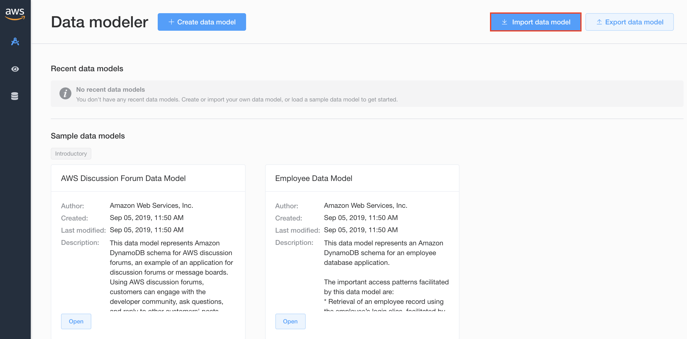

After import the model you'll be able to see the model:

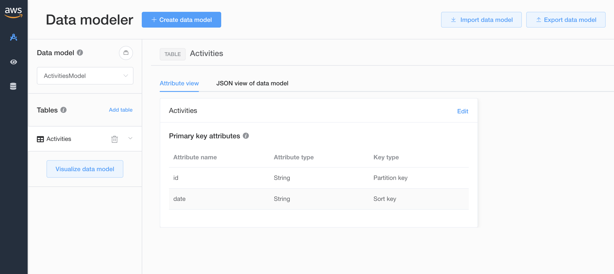

Now you need to create a new connection, click on the database icon:

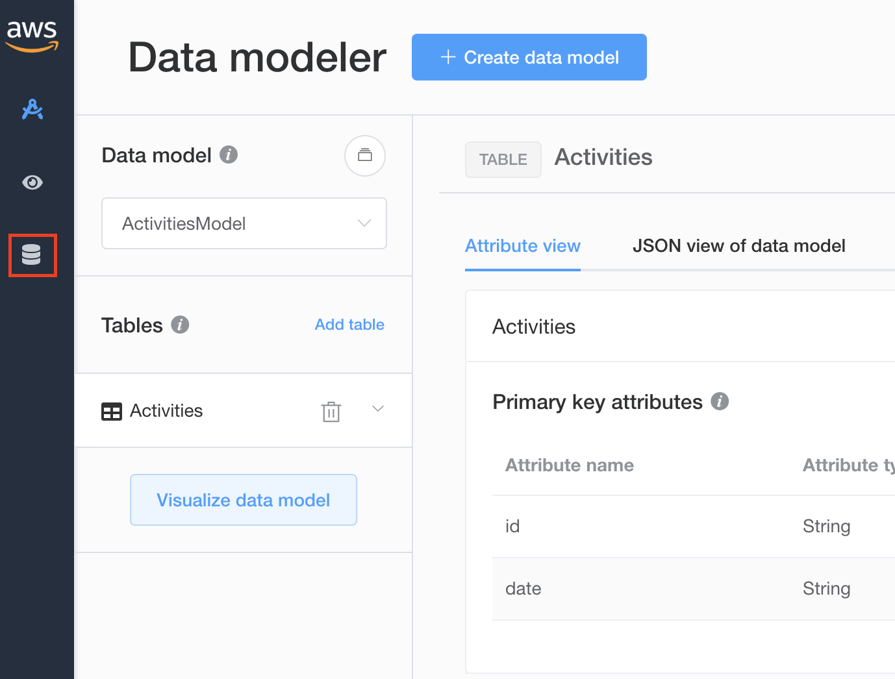

Click on '+ Add connection':

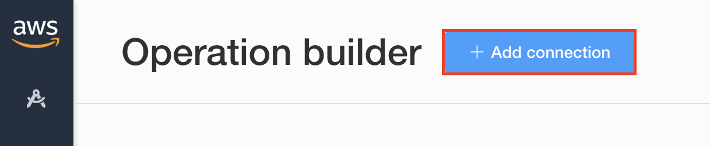

Set the connection name and port (e.g. Local, 8000) and click 'Connect':

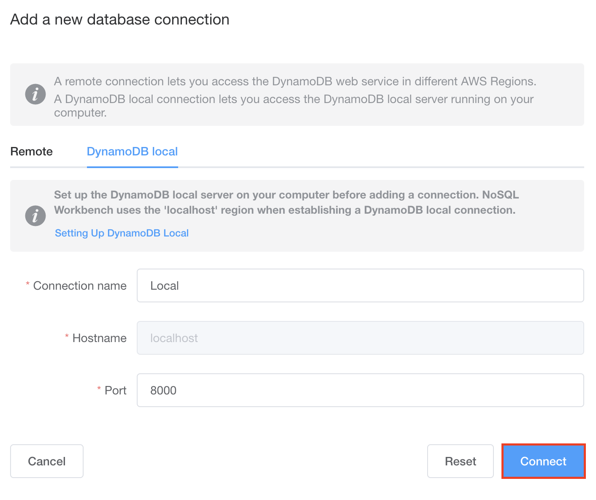

Open the new connection:

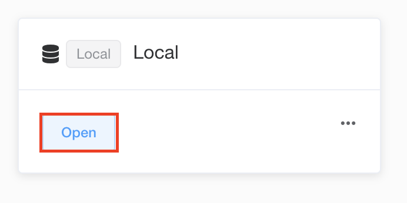

After test the connection you need to deploy the data model:

In the data modeler screen click on 'Visualize data model':

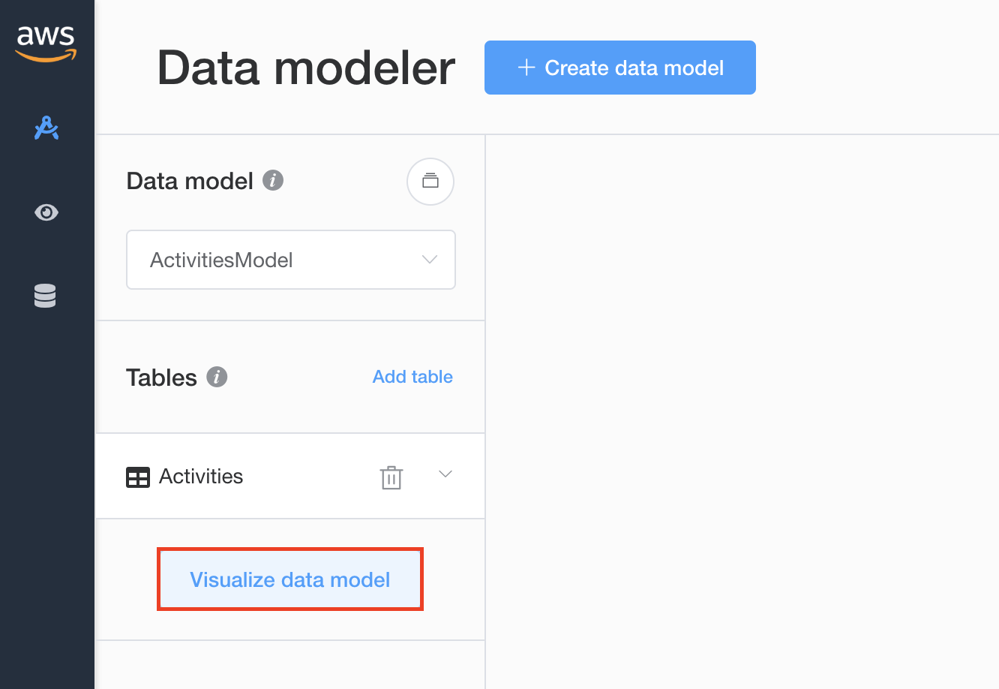

Now click on 'Commit to DynamoDB':

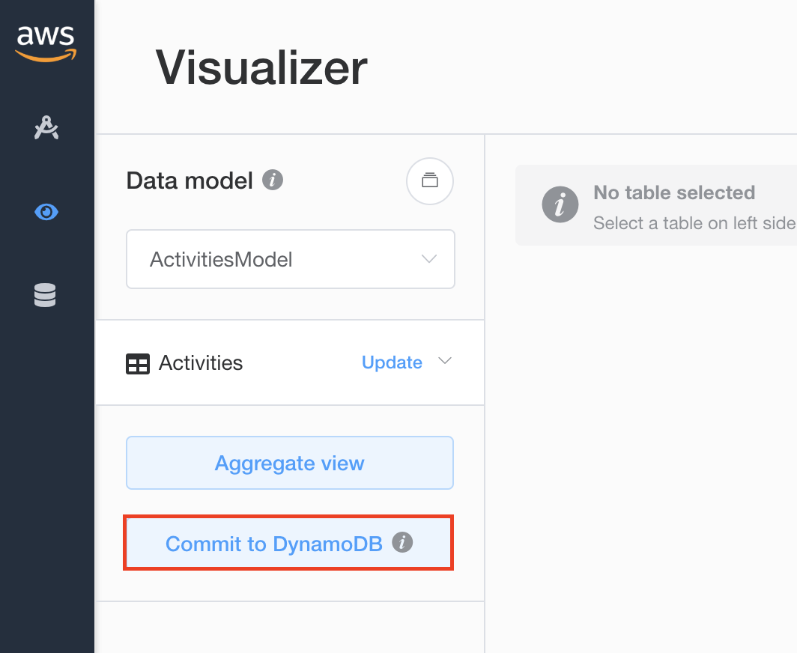

Choose the connection that was created (e.g Local):

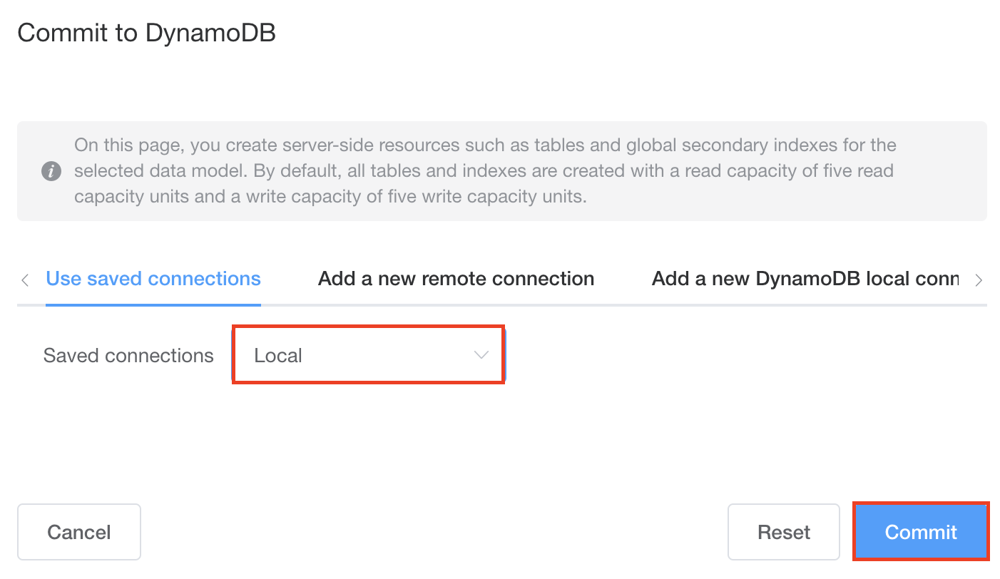

Open the connection again:

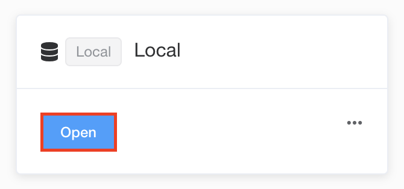

The table was created, nice!

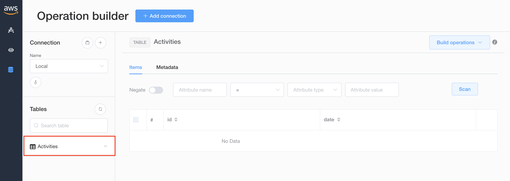
